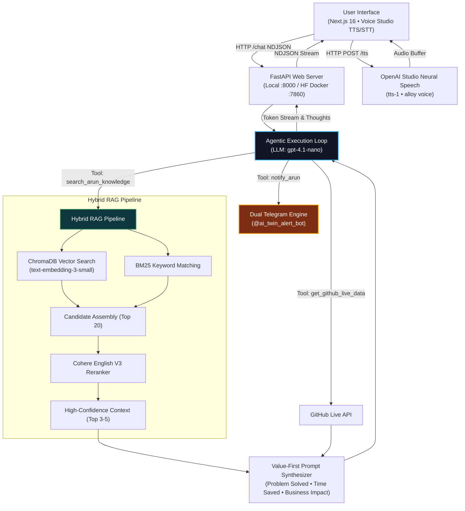

# ArunCore: High-Level System Design

This document outlines the production architecture, component interactions, and data flow for the ArunCore personal AI assistant.

---

## 🏗️ System Architecture Diagram

---

## 📁 Component Breakdown

### 1. 💻 User Interface (Next.js 16 • Turbopack)
- **Default Light Mode**: Executive styling with high contrast tokens.
- **Voice Studio**:
  - **Speech-to-Text (STT)**: Real-time browser Microphone (`[ 🎙️ ]`) transcription.
  - **Text-to-Speech (TTS)**: High-definition neural studio voice button (`[ 🔊 Listen (HD Voice) ]`).
- **Real-Time NDJSON Streaming**: Token-by-token response rendering with live execution trace drawer.

### 2. 🌐 FastAPI Backend Server (`core/api.py`)
- Mounts Next.js static export (`frontend/out`) at root `/`.
- Exposes `/chat` (NDJSON token streaming) and `/tts` (audio synthesis).
- Operates on port `8000` locally and port `7860` inside Hugging Face Docker containers.

### 3. 🧠 Agentic Reasoning Core (`core/agent.py`)
- Powered by OpenAI's **`gpt-4.1-nano`** model ($0.05/1M input, $0.15/1M output).
- **Persona & Tone**: Casual, witty, cool-friend Indian boy vibe with zero corporate fluff.
- **Dynamic Language Matching**: Natural Hinglish for Hindi queries, clean articulate English for international/corporate queries.
- **Value & Problem-Solving First Rule**: On all project inquiries, the assistant leads with **real-world business value, problem-solving impact, and time/cost savings** before code specs.

### 4. 🔍 Hybrid RAG Pipeline
- **Dense Retrieval**: ChromaDB storing `text-embedding-3-small` vector embeddings.
- **Sparse Retrieval**: BM25 keyword matching.
- **Reranker Core**: **Cohere English V3 Reranker** filtering candidate chunks down to top 3–5 high-confidence snippets.

### 5. 🚨 Dual Telegram Alert & Logging Engine
- **Lead Alert Bot (`@ai_twin_alert_bot`)**: Fires instant phone alerts when visitors request hiring, consulting, or project collaborations.
- **Log Bot**: Asynchronously logs conversation transcripts and debug traces in the background.

### 6. 🐙 Live GitHub Engine (`get_github_live_data`)
- Fetches real-time public repositories, commit timestamps, and project activity directly from GitHub API.
