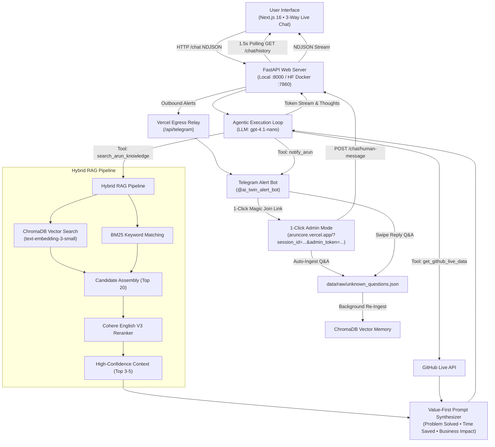

# ArunCore: High-Level System Design & Architecture

This document outlines the production architecture, component interactions, state machine, and data flows for **ArunCore**.

---

## 🏗️ System Architecture Diagram

---

## 📁 Component Breakdown

### 1. 💻 User Interface (Next.js 16 • Vercel Deployment)
- **3-Way Live Chat**: Unified chat room displaying messages for Web Visitor (`user`), AI Assistant (`twin`), and Real Arun (`human_arun`) with a glowing green verified badge (`👨‍💻 Arun Yadav [VERIFIED HUMAN] 🟢`).
- **1-Click Magic Link Admin Mode**: Tapping a Telegram magic link opens `aruncore.vercel.app` in Admin Mode, unlocking the Admin Reply Bar (`[ 👨‍💻 SEND AS REAL ARUN ]`, `[ 🤖 Trigger AI Answer (/answer) ]`, `[ 🔄 Hand Back to AI (/release) ]`).
- **Voice Studio**: STT microphone button with duplicate-free transcription & HD neural TTS voice button (`/tts` endpoint).

### 2. 🌐 FastAPI Backend Server (`core/api.py`)
- Manages real-time NDJSON streaming (`/chat`), 3-way transcript persistence (`GET /chat/history`), human message submission (`POST /chat/human-message`), and admin token verification (`GET /chat/verify-admin-token`).

### 3. 🕹️ Deterministic Human Control State Machine
- **Normal Default Mode**: AI Twin answers visitor questions automatically.
- **Human Control Mode**: Real Arun's first response pauses the AI Twin. Visitor questions wait for Real Arun's reply or command.
- **`/answer` Command**: Triggers the AI Twin to synthesize all 3 participants' messages and generate a response.
- **`/release` Command**: Hands control back to automatic AI Twin responses.

### 4. 🌐 Vercel Serverless Egress Relay (`frontend/app/api/telegram/route.ts`)
- Routes outbound Telegram POST requests through Vercel serverless functions, bypassing Hugging Face Space firewall drop timeouts.

### 5. 🧠 Real-Time Active Learning & RAG Memory
- Real Arun's answers (from website Admin Reply Bar or Telegram swipe replies) are automatically saved to `data/raw/unknown_questions.json` and re-ingested into ChromaDB in real time.
